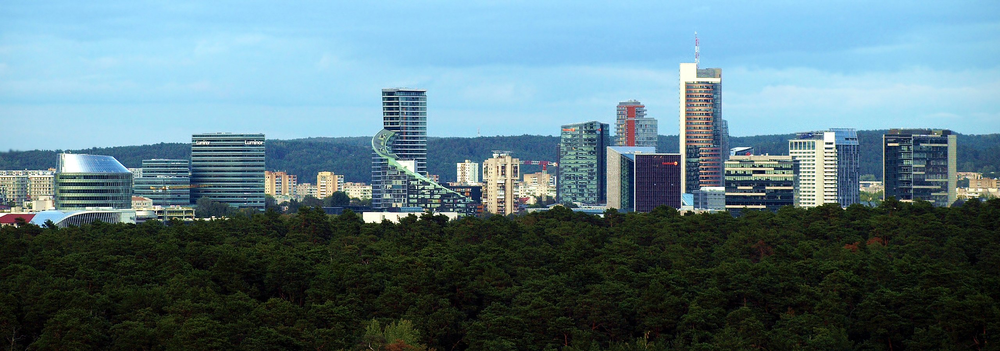

```{r setup, include=FALSE}
knitr::opts_chunk$set(echo = FALSE)
```

## Vilnius

Vilnius is capital of Lithuania. Rotuse is City Hall.

```{r map, message=FALSE, warning=FALSE}
library(leaflet)
df<-data.frame(lat=54.678214,lng=25.286930         )
map<-leaflet(df) %>% addTiles() %>% addMarkers(lat=54.678214,lng=25.286930 , popup = "Rotuse - City Hall")
map
```

## Some facts about Vilnius

- First mentioned	1323
- Area 401 km^2 
- Population 580,020

```{r, out.width = "80%"}
library(jpeg)
library(knitr)

```

## Vilnius population with color as growth rate

```{r, message=FALSE, warning=FALSE}
library(plotly)
vln<-as.data.frame(read.csv("vilnius_pop.csv", header = TRUE, sep = ","))
plot_ly(vln, x=vln$Year, y=vln$Population, color=as.numeric(sub("%", "", vln$Growth.Rate)),mode = 'markers', width=4)
```


